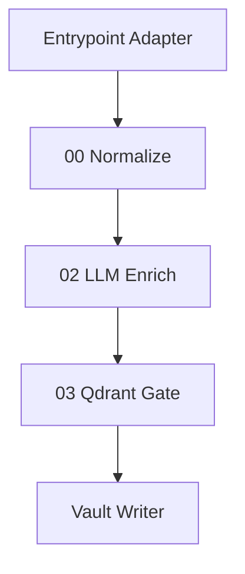

# 给本地 AI 的项目上下文采集任务

> 用途：把这份文件交给本地 AI / 本地编程助手，让它在你的项目本地工作区中生成一份可发给 GPT Pro 的事实上下文包。
> 目标：让我后续基于**真实 repo、本地未提交改动、n8n runtime、Docker 状态、Qdrant 状态、测试结果**来判断项目架构，而不是靠猜测。

---

## 0. 给本地 AI 的角色说明

你现在不是来重构代码，也不是来给最终架构方案。你的角色是：

```text
本地项目事实采集员 + 上下文整理员 + 风险线索标注员
```

你的任务是读取当前本地项目，并生成一份结构化的 `ai_context_pack_generated` 上下文包，供外部 GPT Pro 进行架构审查、模型打分机制审查和实现路线判断。

---

## 1. 重要约束

### 1.1 禁止修改项目业务文件

除非明确写入输出目录，否则不要修改任何项目文件。

允许创建：

```text
ai_context_pack_generated/
```

禁止修改：

```text
deploy/
services/
contracts/
scripts/
README.md
任何 n8n workflow JSON
任何 .env
任何 docker compose 文件
```

如果你认为需要修改代码，请只写入建议，不要实际修改。

---

### 1.2 必须保护密钥和隐私

不要输出任何真实密钥、token、cookie、账号密码、Webhook secret、API key、数据库密码或完整私密内容。

需要读取 `.env` 时，只能输出：

```text
KEY_NAME=SET
KEY_NAME=EMPTY
KEY_NAME=MISSING
```

或者：

```text
KEY_NAME=REDACTED(length=xx)
```

不要输出真实值。

日志中如果出现疑似密钥，请替换成：

```text
[REDACTED_SECRET]
```

需要特别打码的关键词包括但不限于：

```text
API_KEY
SECRET
TOKEN
PASSWORD
COOKIE
AUTH
OPENAI
DEEPSEEK
LLM
EMBEDDING
WEBHOOK
```

---

### 1.3 不要把 GitHub repo 等同于本地真实状态

本项目存在三层事实：

```text
1. repo fact：Git 仓库中已提交或本地文件中的事实
2. local fact：本地未提交改动、新增文件、临时目录、diff
3. runtime fact：Docker、n8n SQLite、live workflow、Qdrant、日志、实际执行结果
```

请你所有结论都标注来源：

```text
[repo]
[local]
[runtime]
[test]
[inference]
[unknown]
```

不要把推断写成事实。

---

### 1.4 不要建议删功能

项目原则：

```text
功能不删。
入口不砍。
模块可以分层、feature flag、隔离、排优先级，但不因为“单人维护”而删除功能。
```

你可以指出：

```text
- 哪些功能是 Core
- 哪些功能是 Attached
- 哪些功能是 Experimental
- 哪些功能是 Planned
- 哪些功能需要更强边界
```

但不要建议直接删除 Memos、ManicTime、微信群总结、订阅管理、im2memo、transcript 等能力。

---

## 2. 项目不可变原则

请在生成上下文包时始终保留这些原则：

```text
1. Obsidian Vault 是最终知识库 / 主事实库。
2. Qdrant 是去重和相似度索引，应该可重建，不应成为唯一事实源。
3. n8n 是流程编排层，不应该成为隐藏业务逻辑黑箱。
4. Git repo 是配置和代码的真相源，但 live n8n runtime 必须单独验证。
5. 所有入口必须收口到统一主链。
6. 所有入口必须复用统一对象契约，不允许 RSS、transcript、manual、memos 各自发明字段体系。
7. 04_video_transcript_ingest 的角色是 transcript ingress adapter，不是第二条主链。
8. 大模型只负责摘要、分类、标签、评分、解释、差异判断等增强任务；最终动作应由规则矩阵决定。
9. 模型评分机制必须可复现、可审计、可校准。
10. 私密内容不能默认发送到外部大模型。
```

---

## 3. 你要生成的目录结构

请在项目根目录创建：

```text
ai_context_pack_generated/
  00_MANIFEST.md
  01_PROJECT_GOAL_AND_PRINCIPLES.md
  02_REPO_SNAPSHOT.md
  03_LOCAL_CHANGES.md
  04_RUNTIME_SNAPSHOT.md
  05_N8N_RUNTIME_STATE.md
  06_WORKFLOW_INVENTORY_AND_DRIFT.md
  07_CONTRACT_AND_SCHEMA_STATUS.md
  08_LLM_SCORING_AND_MODEL_POLICY.md
  09_DATA_FLOW_AND_ENTRYPOINTS.md
  10_RECENT_FAILURES_AND_LOGS.md
  11_TEST_AND_SMOKE_RESULTS.md
  12_OPEN_QUESTIONS_AND_ASSUMPTIONS.md
  13_FINAL_CONTEXT_FOR_GPT_PRO.md
  raw/
    git_status.txt
    git_diff.patch
    docker_ps.txt
    docker_logs_n8n.txt
    docker_logs_qdrant.txt
    docker_logs_transcript.txt
    n8n_sqlite_tables.txt
    n8n_workflow_entity.txt
    qdrant_collections.json
    workflow_file_list.txt
    workflow_summary.jsonl
```

如果某些文件无法生成，请保留文件并写明：

```text
无法生成原因：...
尝试过的命令：...
错误输出摘要：...
```

---

## 4. 第一部分：生成 `00_MANIFEST.md`

请写入本次采集的基本信息。

建议内容：

```markdown
# AI Context Pack Manifest

## Snapshot

- generated_at:
- project_root:
- current_user:
- os:
- git_branch:
- git_commit:
- working_tree_dirty: true/false
- docker_available: true/false
- docker_compose_available: true/false
- n8n_sqlite_found: true/false
- qdrant_reachable: true/false
- generated_by: local AI

## Purpose

这份上下文包用于发送给 GPT Pro，请其基于 repo、本地 diff、runtime 状态、workflow 状态、模型策略和测试结果审查项目架构。

## Important Reminder

Git repo 状态不等于 live n8n runtime 状态。所有 runtime 结论必须基于 Docker、SQLite、n8n live workflow、日志或测试结果。
```

建议命令：

```bash
pwd
date -Iseconds
whoami
uname -a
git branch --show-current
git rev-parse HEAD
git status --short
```

---

## 5. 第二部分：生成 `01_PROJECT_GOAL_AND_PRINCIPLES.md`

请根据当前仓库文档和已知目标，总结项目目标。

必须包含：

```markdown
# Project Goal and Principles

## Project Goal

这个项目是个人信息获取、清洗、转录、去重、增强、归档、复盘系统。

## Major Inputs

- RSS
- 视频 / 播客 / 音频 transcript
- 手动 URL 提交
- Memos
- 图片 / im2memo
- 微信群总结
- ManicTime / 个人活动流
- 未来订阅管理 Web 端

## Core Pipeline

多入口 adapter -> NormalizedTextObject -> LLM enrich/scoring -> Qdrant dedupe -> Vault writer -> index/log/review/notification

## Non-negotiable Principles

- 功能不删，只做边界治理和分层。
- 所有入口复用统一对象契约。
- Obsidian 是主事实库。
- Qdrant 是可重建索引。
- Git repo 和 n8n runtime 必须防漂移。
- 04_video_transcript_ingest 是 adapter。
- 大模型评分要结构化、版本化、审计化。
```

如果仓库里已有相关文件，请引用文件路径和摘要。

---

## 6. 第三部分：生成 `02_REPO_SNAPSHOT.md`

请采集 repo 文件结构、关键文件和当前提交状态。

建议命令：

```bash
git rev-parse HEAD
git branch --show-current
git log --oneline -n 20
git status --short
git diff --stat
find . -maxdepth 3 -type f \
  -not -path './.git/*' \
  -not -path './deploy/data/*' \
  -not -path './node_modules/*' \
  -not -path './.venv/*' \
  | sort
```

需要重点扫描这些路径是否存在：

```text
AI信息处理系统_架构校正版.md
deploy/README.md
deploy/compose.yaml
deploy/.env.example
deploy/n8n/WORKFLOW_NOTES.md
deploy/n8n/workflows/
deploy/n8n/scripts/
deploy/vault/README.md
services/VideoTranscriptAPI/
contracts/
scripts/
```

输出格式：

```markdown
# Repo Snapshot

## Git State

...

## Key Files Present

| Path | Exists | Notes |
|---|---:|---|

## Workflow Files in Repo

| File | Name | Active | ID | Notes |
|---|---|---:|---|---|

## Important Repo Observations

- [repo] ...
- [repo] ...
```

---

## 7. 第四部分：生成 `03_LOCAL_CHANGES.md`

请记录本地未提交修改和新增文件。

建议命令：

```bash
git status --short > ai_context_pack_generated/raw/git_status.txt
git diff > ai_context_pack_generated/raw/git_diff.patch
git diff --stat
```

如果 diff 很大，请不要全文塞进主 md，只做摘要，并保留 raw patch。

输出格式：

```markdown
# Local Changes

## Working Tree Status

```text
粘贴 git status --short
```

## Diff Stat

```text
粘贴 git diff --stat
```

## Important Changed Files

| Path | Change Type | Why It Matters |
|---|---|---|

## New Local Files Not in Git

| Path | Role Guess | Should GPT Pro Inspect? |
|---|---|---|

## Local Facts That May Differ From GitHub

- [local] ...
- [local] ...
```

重点检查是否存在：

```text
deploy/n8n/workflows/06_manual_media_submit.json
deploy/tmp-feed/
deploy/tmp-real-feed/
本地修改过的 01_rss_to_obsidian_raw.json
本地修改过的 03_qdrant_gate.json
本地修改过的 compose.yaml
本地修改过的 .env.example
```

---

## 8. 第五部分：生成 `04_RUNTIME_SNAPSHOT.md`

请采集 Docker Compose runtime 状态。

建议命令：

```bash
docker compose ps > ai_context_pack_generated/raw/docker_ps.txt 2>&1 || true
docker compose config --services > ai_context_pack_generated/raw/docker_services.txt 2>&1 || true
docker compose logs --tail=200 n8n > ai_context_pack_generated/raw/docker_logs_n8n.txt 2>&1 || true
docker compose logs --tail=200 qdrant > ai_context_pack_generated/raw/docker_logs_qdrant.txt 2>&1 || true
docker compose logs --tail=200 video-transcript-api > ai_context_pack_generated/raw/docker_logs_transcript.txt 2>&1 || true
docker compose logs --tail=200 funasr-spk-server > ai_context_pack_generated/raw/docker_logs_funasr.txt 2>&1 || true
```

如果服务名称不同，请先用：

```bash
docker compose config --services
```

再选择对应服务名。

输出格式：

```markdown
# Runtime Snapshot

## Docker Compose Services

| Service | Running? | Ports | Health / Notes |
|---|---:|---|---|

## Important Runtime Observations

- [runtime] ...

## Runtime Risks

| Risk | Evidence | Impact |
|---|---|---|
```

请特别关注：

```text
n8n 是否启动
Qdrant 是否启动
Redis 是否启动
Memos 是否启动
RSSHub 是否启动
VideoTranscriptAPI 是否启动
FunASR / CapsWriter 是否启动
端口是否只绑定 127.0.0.1
n8n 是否使用 latest 镜像
是否存在 task runner timeout 相关环境变量
```

---

## 9. 第六部分：生成 `05_N8N_RUNTIME_STATE.md`

请采集 n8n runtime 状态，重点判断 repo workflow JSON 和 live n8n 是否可能漂移。

### 9.1 SQLite 检查

优先检查：

```text
deploy/data/n8n/database.sqlite
```

建议命令：

```bash
DB="deploy/data/n8n/database.sqlite"
if [ -f "$DB" ]; then
  sqlite3 "$DB" ".tables" > ai_context_pack_generated/raw/n8n_sqlite_tables.txt 2>&1 || true
  sqlite3 "$DB" "SELECT id, name, active, activeVersionId, updatedAt FROM workflow_entity ORDER BY updatedAt DESC;" > ai_context_pack_generated/raw/n8n_workflow_entity.txt 2>&1 || true
  sqlite3 "$DB" "SELECT workflowId, versionId, authors, createdAt, updatedAt FROM workflow_history ORDER BY createdAt DESC LIMIT 50;" > ai_context_pack_generated/raw/n8n_workflow_history.txt 2>&1 || true
else
  echo "database.sqlite not found at $DB" > ai_context_pack_generated/raw/n8n_sqlite_tables.txt
fi
```

如果 schema 不匹配，请改用：

```bash
sqlite3 "$DB" ".schema workflow_entity"
sqlite3 "$DB" ".schema workflow_history"
```

并把可用字段输出。

### 9.2 n8n workflow 导出尝试

尝试导出 live workflows：

```bash
mkdir -p ai_context_pack_generated/raw/live_workflows

docker compose exec -T n8n n8n export:workflow --all --output=/tmp/live_workflows.json > ai_context_pack_generated/raw/n8n_export_stdout.txt 2>&1 || true

docker compose cp n8n:/tmp/live_workflows.json ai_context_pack_generated/raw/live_workflows/live_workflows.json > ai_context_pack_generated/raw/n8n_export_cp_stdout.txt 2>&1 || true
```

如果命令失败，请记录失败原因，不要强行修复。

输出格式：

```markdown
# n8n Runtime State

## SQLite Found

- path:
- found:
- readable:

## workflow_entity Summary

| ID | Name | Active | activeVersionId | updatedAt |
|---|---|---:|---|---|

## workflow_history Summary

| workflowId | versionId | createdAt | Notes |
|---|---|---|---|

## Possible Repo vs Runtime Drift

| Workflow | Repo Exists | Runtime Exists | Active | Drift Risk | Evidence |
|---|---:|---:|---:|---|---|

## Important Notes

- [runtime] ...
- [unknown] ...
```

重点判断：

```text
00_common_normalize_text_object 是否存在且 active
01_rss_to_obsidian_raw 是否 active
02_enrich_with_llm 是否存在
03_qdrant_gate 是否存在
04_video_transcript_ingest 是否存在
06_manual_media_submit 是否只在本地文件存在，还是 runtime 也存在
90_local_verify_transcript_mainline 是否存在
activeVersionId 是否为空或异常
workflow_history 是否比 repo JSON 更新
```

---

## 10. 第七部分：生成 `06_WORKFLOW_INVENTORY_AND_DRIFT.md`

请扫描 `deploy/n8n/workflows/*.json`，生成 workflow 清单和职责判断。

建议命令：

```bash
find deploy/n8n/workflows -maxdepth 1 -name '*.json' | sort > ai_context_pack_generated/raw/workflow_file_list.txt
```

如果有 `jq`：

```bash
for f in deploy/n8n/workflows/*.json; do
  jq -c '{file: input_filename, id: .id, name: .name, active: .active, node_count: (.nodes|length), updatedAt: .updatedAt}' "$f"
done > ai_context_pack_generated/raw/workflow_summary.jsonl 2>&1 || true
```

如果没有 `jq`，请用 Python 解析 JSON。

输出格式：

```markdown
# Workflow Inventory and Drift

## Workflow Inventory

| File | Name | Active | Node Count | Main Role | Should Be Shared Infrastructure? |
|---|---|---:|---:|---|---:|

## Expected Roles

| Workflow | Expected Role | Current Evidence | Risk |
|---|---|---|---|
| 00_common_normalize_text_object | normalize shared object | ... | ... |
| 01_rss_to_obsidian_raw | RSS ingress / current writer host | ... | ... |
| 02_enrich_with_llm | LLM enrich/scoring | ... | ... |
| 03_qdrant_gate | dedupe / index gate | ... | ... |
| 04_video_transcript_ingest | transcript adapter | ... | ... |
| 06_manual_media_submit | manual media entrypoint | ... | ... |
| 90_local_verify_transcript_mainline | local verification workflow | ... | ... |

## Potential Second Field-System Risks

请检查是否有入口绕过 00，或自己生成 item_id/content_hash/tags/summary/score/vault_path 等字段。

| File | Suspicious Field / Logic | Why It May Be Risky | Evidence |
|---|---|---|---|
```

请搜索这些字段：

```bash
grep -R "item_id\|content_hash\|source_type\|canonical_url\|content_text\|summary\|score\|category\|tags\|dedupe_action\|vault_path\|transcript_text\|raw_text\|obsidian" -n deploy/n8n/workflows deploy/n8n/WORKFLOW_NOTES.md deploy/README.md 2>/dev/null > ai_context_pack_generated/raw/field_usage_grep.txt || true
```

---

## 11. 第八部分：生成 `07_CONTRACT_AND_SCHEMA_STATUS.md`

请判断对象契约是否已经机器化。

检查：

```text
contracts/
*.schema.json
NormalizedTextObject
EnrichedTextObject
DedupeDecision
LLMScore
Vault frontmatter
示例 fixtures
schema validation scripts
```

建议命令：

```bash
find . -maxdepth 4 \( -path './.git' -o -path './deploy/data' -o -path './node_modules' \) -prune -o -type f \( -name '*schema*.json' -o -name '*contract*' -o -name '*fixture*' -o -name '*example*.json' \) -print | sort

grep -R "NormalizedTextObject\|LLMScore\|DedupeDecision\|schema\|contract\|frontmatter" -n . \
  --exclude-dir=.git --exclude-dir=deploy/data --exclude-dir=node_modules 2>/dev/null \
  > ai_context_pack_generated/raw/contract_grep.txt || true
```

输出格式：

```markdown
# Contract and Schema Status

## Contract Files

| Path | Exists | Role | Notes |
|---|---:|---|---|

## Current Core Object Fields Observed

| Field | Found In | Meaning | Stable? | Risk |
|---|---|---|---:|---|

## Field Drift Candidates

| Candidate | Where Found | Possible Canonical Field | Risk |
|---|---|---|---|

## Missing Machine Validation

- [unknown/repo/local] ...

## Recommended Questions For GPT Pro

- ...
```

重点检查字段漂移：

```text
raw_text vs content_text
raw_html vs content_html
transcript_text vs content_text
calibrated_transcript vs content_text
obsidian_inbox_dir vs obsidianInboxDir
score 0~1 vs score 0~100
action vs dedupe_action
tag / tags / ai_tags / suggested_tags
vault_path / filepath / note_path
```

---

## 12. 第九部分：生成 `08_LLM_SCORING_AND_MODEL_POLICY.md`

请专门整理大模型使用和评分机制现状。

检查范围：

```text
deploy/.env.example
deploy/compose.yaml
deploy/n8n/workflows/02_enrich_with_llm.json
deploy/n8n/workflows/03_qdrant_gate.json
任何 prompt / scoring / model policy 文件
```

建议命令：

```bash
grep -R "LLM_\|EMBEDDING_\|MODEL\|score\|summary\|category\|tags\|reason\|confidence\|prompt\|temperature\|max_tokens\|deepseek\|openai\|text-embedding" -n deploy services contracts scripts 2>/dev/null > ai_context_pack_generated/raw/llm_policy_grep.txt || true
```

输出格式：

```markdown
# LLM Scoring and Model Policy

## Current Model Configuration

| Setting | Source | Value / Redacted | Notes |
|---|---|---|---|
| LLM_BASE_URL | .env.example / .env redacted | ... | ... |
| LLM_MODEL | ... | ... | ... |
| EMBEDDING_MODEL | ... | ... | ... |
| QDRANT_VECTOR_SIZE | ... | ... | ... |

## Current LLM Responsibilities

| Responsibility | Implemented? | Where | Notes |
|---|---:|---|---|
| summary | ... | ... | ... |
| category | ... | ... | ... |
| tags | ... | ... | ... |
| score | ... | ... | ... |
| reason | ... | ... | ... |
| confidence | ... | ... | ... |
| structured dimensions | ... | ... | ... |
| prompt_version | ... | ... | ... |
| rubric_version | ... | ... | ... |
| privacy routing | ... | ... | ... |
| cache / audit log | ... | ... | ... |

## Current Score Semantics

请说明当前 score 是 0~1 还是 0~100，是否有 keep_score / notify_score / reference_score / action_score，是否存在 confidence。

## Model Usage Risks

| Risk | Evidence | Impact | Needs GPT Pro Attention? |
|---|---|---|---:|

## Suggested Missing Pieces To Ask GPT Pro

- LLMScore schema
- scoring_profile.default.yaml
- prompt_version / rubric_version
- long transcript chunking policy
- privacy-aware model routing
- LLM cache and audit log
- rule-based action matrix
```

必须特别判断：

```text
1. 大模型是否直接决定写库/通知，还是只输出建议？
2. score 是否和 dedupe_action 混在一起？
3. 是否有 confidence？
4. 是否记录 prompt_version / model / rubric_version？
5. 私密内容是否默认可发外部 LLM？
6. transcript 长文本是否有分块策略？
7. 是否存在 LLM 调用缓存？
8. 是否有失败重试和 JSON schema 校验？
```

---

## 13. 第十部分：生成 `09_DATA_FLOW_AND_ENTRYPOINTS.md`

请整理所有入口、主链、支路和写库路径。

输出格式：

```markdown
# Data Flow and Entrypoints

## Entrypoints

| Entrypoint | Status | Workflow / Service | Expected Path | Actually Verified? |
|---|---|---|---|---:|
| RSS | ... | ... | adapter -> 00 -> 02 -> 03 -> writer | ... |
| Transcript | ... | 04 | 04 -> 00 -> 02 -> 03 -> writer | ... |
| Manual media | ... | 06 | 06 -> 04 -> 00 -> 02 -> 03 -> writer | ... |
| Memos | ... | ... | ... | ... |
| im2memo | ... | ... | ... | ... |
| 微信群总结 | ... | ... | ... | ... |
| ManicTime | ... | ... | ... | ... |
| Daily analysis | ... | ... | ... | ... |

## Current Main Chain

请用 Mermaid 或文本图说明。



## Where Vault Writing Happens

| Writer Logic Location | Shared? | Risk |
|---|---:|---|

## Where Qdrant Upsert Happens

| Workflow | Before or After Vault Write? | Risk |
|---|---|---|

## Potential Mainline Split Risks

- ...
```

重点回答：

```text
1. Vault Writer 是否已共享化？
2. Qdrant upsert 是否发生在 Vault write 之前？
3. 04 是否只是 adapter？
4. 06 是否复用 04/00/02/03？
5. 是否存在入口绕过主链直接写 Vault？
6. 是否存在入口绕过 00 直接拼字段？
```

---

## 14. 第十一部分：生成 `10_RECENT_FAILURES_AND_LOGS.md`

请收集最近失败、异常、非直觉 runtime 问题。

不要只收成功路径。

需要关注：

```text
executeWorkflow 子流程错误是否被父流程吞掉
webhook 是否返回泛化 500
n8n runner timeout
transcript service 是否能访问 FunASR / CapsWriter
长 transcript embedding 是否失败
Qdrant vector size 是否不匹配
LLM JSON 输出是否解析失败
Vault 写入是否失败
权限问题
容器网络问题
```

输出格式：

```markdown
# Recent Failures and Logs

## Known Runtime Failure Patterns

| Failure | Evidence | Likely Layer | Retryable? | Needs Design Change? |
|---|---|---|---:|---:|

## Log Excerpts

请只粘贴必要摘要，且必须打码。

## Open Runtime Questions

- ...
```

---

## 15. 第十二部分：生成 `11_TEST_AND_SMOKE_RESULTS.md`

请运行或检查已有 smoke tests。不要强行修复，只记录结果。

先查找测试脚本：

```bash
find . -maxdepth 5 -type f \( -name '*test*' -o -name '*smoke*' -o -name '*verify*' -o -name '*check*' \) \
  -not -path './.git/*' -not -path './deploy/data/*' \
  | sort > ai_context_pack_generated/raw/test_file_list.txt
```

如果存在这些脚本，可以尝试运行，失败也要记录：

```bash
python deploy/n8n/scripts/smoke_qdrant_gate.py > ai_context_pack_generated/raw/smoke_qdrant_gate.txt 2>&1 || true
python deploy/n8n/scripts/sync_workflows.py --help > ai_context_pack_generated/raw/sync_workflows_help.txt 2>&1 || true
```

不要执行会破坏数据或大量写库的命令，除非脚本明确是只读或 smoke test。

输出格式：

```markdown
# Test and Smoke Results

## Test Files Found

| Path | Purpose Guess | Safe To Run? | Ran? | Result |
|---|---|---:|---:|---|

## Smoke Results

| Test | Result | Evidence | Notes |
|---|---|---|---|

## Untested Critical Paths

| Path | Why Critical | Suggested Test |
|---|---|---|
```

重点标注哪些没有测过：

```text
RSS -> Vault
Transcript -> Vault
Manual media -> Transcript -> Vault
Qdrant dedupe silent/full_push/diff_push
LLM scoring JSON schema
Vault writer idempotency
repo workflow -> live n8n sync
private content external LLM skip
```

---

## 16. 第十三部分：生成 `12_OPEN_QUESTIONS_AND_ASSUMPTIONS.md`

请整理给 GPT Pro 的问题和假设。

输出格式：

```markdown
# Open Questions and Assumptions

## P0 Blocking Questions

最多 3 个。只有真正不回答就无法判断架构的问题才放这里。

| Question | Why Blocking | How To Get Answer | Default Assumption If Missing |
|---|---|---|---|

## P1 Important But Non-blocking Questions

| Question | Impact | Default Assumption |
|---|---|---|

## Assumption Register

| Assumption | Source | Confidence | Impact | How To Verify |
|---|---|---:|---|---|

## Facts vs Inferences

| Statement | Type | Evidence |
|---|---|---|
```

原则：

```text
不要问 7~8 个散乱问题。
最多问 3 个 P0。
其他放入 assumption register。
```

---

## 17. 第十四部分：生成 `13_FINAL_CONTEXT_FOR_GPT_PRO.md`

这是最终要发给 GPT Pro 的主文件。请把前面内容压缩成一份可读的上下文。

它必须包含：

```markdown
# Final Context for GPT Pro

## 1. What I Need You To Do

请基于这份上下文审查项目架构、大模型评分机制、统一对象契约、runtime 漂移风险和下一步实施路线。

## 2. Non-negotiable Constraints

- 不要建议删除功能。
- 所有入口必须复用统一主链。
- 不允许各入口发明第二套字段体系。
- Git repo 不等于 live n8n runtime。
- 04_video_transcript_ingest 是 transcript adapter。
- 大模型评分必须结构化、版本化、审计化。
- 私密内容不能默认外发大模型。

## 3. Current Project Summary

用 10~20 条 bullet 总结。

## 4. Evidence Table

| Claim | Source Type | Evidence File / Path | Confidence |
|---|---|---|---:|

## 5. Current Architecture

文本图或 Mermaid。

## 6. Entrypoints and Status

| Entrypoint | Status | Evidence | Risk |
|---|---|---|---|

## 7. Workflow State

| Workflow | Repo Status | Runtime Status | Role | Drift Risk |
|---|---|---|---|---|

## 8. Contract / Field System Status

说明 NormalizedTextObject、LLM score、dedupe_action、vault_path 等字段现状。

## 9. LLM Scoring and Model Policy Status

说明当前模型配置、score 机制、缺口。

## 10. Runtime and Failure Evidence

列出最近真实失败和 runtime 风险。

## 11. What I Want GPT Pro To Judge

请 GPT Pro 判断：

1. 当前架构是否存在主链分裂风险。
2. NormalizedTextObject 边界是否足够支撑所有入口。
3. Vault Writer 是否应该共享化，以及如何共享。
4. Qdrant search / upsert 与 Vault write 的提交顺序是否合理。
5. LLM scoring policy 应如何设计成统一机制。
6. repo truth vs n8n runtime truth 如何治理。
7. 哪些问题是 P0，哪些可以后续处理。
8. 如何在功能不删的前提下控制复杂度。

## 12. Instructions To GPT Pro

请 GPT Pro 输出时必须：

- 明确区分事实、推断、未知。
- 所有关键结论标注证据来源。
- 不要给空泛模板。
- 不要建议删除功能。
- 不要假设 GitHub 等于 runtime。
- 最多只问 3 个 P0 补充问题。
- 其他未知写入 assumption register。
- 给出文件级、workflow 级、测试级的可执行建议。
```

---

## 18. 本地 AI 最终回复给用户的格式

完成后，请你只回复用户以下内容：

```markdown
已生成上下文包：

- 主文件：ai_context_pack_generated/13_FINAL_CONTEXT_FOR_GPT_PRO.md
- 完整目录：ai_context_pack_generated/
- 原始日志：ai_context_pack_generated/raw/

建议发送给 GPT Pro 的内容：
1. 先发送 `13_FINAL_CONTEXT_FOR_GPT_PRO.md`
2. 如果 GPT Pro 需要证据，再补充整个 `ai_context_pack_generated/` 目录或关键 raw 文件

注意：我已按要求打码密钥。请你发送前仍然检查 raw 日志中是否有敏感信息。
```

---

## 19. 如果本地 AI 支持自动打包

可以额外生成压缩包：

```bash
zip -r ai_context_pack_generated.zip ai_context_pack_generated
```

但请先确认其中没有密钥、cookie、token、私密正文或不应外发的日志。

---

## 20. 最终质量检查清单

生成完成前，请逐项检查：

```text
[ ] 没有输出真实 .env 密钥
[ ] 没有输出真实 token / cookie / webhook secret
[ ] 已区分 repo / local / runtime / test / inference / unknown
[ ] 已包含 git status 和 git diff 摘要
[ ] 已包含 Docker runtime 摘要
[ ] 已尝试读取 n8n SQLite 状态
[ ] 已列出 workflow inventory
[ ] 已判断 repo workflow 和 live runtime 是否可能漂移
[ ] 已整理 NormalizedTextObject / 字段漂移风险
[ ] 已整理 LLM scoring / model policy 现状
[ ] 已整理入口和主链数据流
[ ] 已整理最近失败和日志摘要
[ ] 已整理测试结果和未测试路径
[ ] 最多只列 3 个 P0 问题
[ ] 已生成 13_FINAL_CONTEXT_FOR_GPT_PRO.md
[ ] 已提醒用户发送前二次检查敏感信息
```
