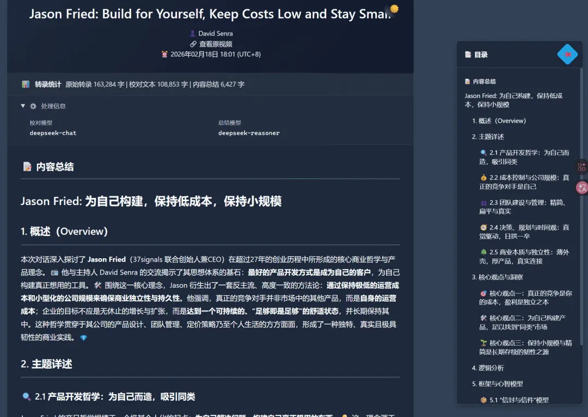

# 视频转录 API (Video Transcript API)

> 基于 Python 3.11+ 的异步视频转录服务，支持多平台下载、双引擎转录、智能文本处理和企业级功能集成。

[](https://www.python.org/downloads/)
[](https://fastapi.tiangolo.com/)
[](LICENSE)

开发契机和玩法分享：[LLM 吞噬一切，我用 AI 长出来的那些工具](https://mp.weixin.qq.com/s/w8VnWJcUp5VkD5J-fYCUrg)



---

## 核心特性

- **多平台支持**：YouTube、Bilibili、抖音、小红书、小宇宙播客，工厂模式自动匹配下载器
- **双引擎转录**：CapsWriter-Offline（通用转录）+ FunASR（说话人识别）
- **智能文本处理**：LLM 自动校对 ASR 错误、专有名词纠错、说话人推断、内容总结
- **企业级功能**：SQLite + 文件系统双层缓存、多用户管理、审计日志、企业微信通知、任务历史浏览器
- **风控系统**：敏感词检测、多策略文本脱敏、风险模型自动切换

## 与 Signal to Obsidian 集成边界

当这个服务作为 `Signal to Obsidian` 的 transcript backend 使用时，需要把语义边界固定住：

- `VideoTranscriptAPI` 负责下载、转录、可选校对、可选 summary/cache，以及相关查看页和导出能力。
- 它不是 canonical enrichment 或 action policy 层。
- 服务内部的 `summary / cache / LLM` 结果，如果要回流到 `Signal to Obsidian`，只能映射到 `upstream_summary` 或 `transcript_service_meta`。
- canonical `summary / score / ai_score / score_dimensions / category / tags / should_write_to_vault / should_notify / notification_mode / should_upsert_qdrant` 必须只由 `Signal to Obsidian` 共享主链里的 `02_enrich_with_llm` 和 `04a_action_policy` 生成。

这意味着：即使本服务已经生成了 `llm_summary.txt`、summary 导出或其他辅助 LLM 结果，下游 adapter 也只能把它们当作上游上下文，不能把它们直接当成最终评分、分类、通知或写入决策。

## 外部依赖

- [Tikhub API key，用于音视频解析下载。有 aff](https://user.tikhub.io/register?referral_code=YArXsaWi)
- [funasr_spk_server：funasr server 对应暴露 api，支持音视频转写，分角色，自动合并相同人物的话。](https://github.com/zj1123581321/funasr_spk_server)
- [CapsWriter-Offline：CapsWriter 的离线版，一个好用的 PC 端的语音输入工具，支持热词、LLM处理。](https://github.com/HaujetZhao/CapsWriter-Offline)
- [youtube_download_api：YouTube 视频下载服务，作为 yt-dlp 的可选替代后端。](https://github.com/zj1123581321/youtube_download_api)（可选）
- OpenAI 兼容的 API，比如 Deepseek，量大管饱。

---

## 快速开始

### 环境要求

- Python 3.11+
- FFmpeg
- 转录服务器（CapsWriter / FunASR 二选一或同时部署）

### 本地安装

```bash
# 克隆仓库
git clone <repository-url>
cd video-transcript-api

# 安装依赖（使用 uv）
curl -LsSf https://astral.sh/uv/install.sh | sh
uv sync

# 配置服务
cp config/config.example.jsonc config/config.jsonc
# 编辑 config.jsonc，填写 api.auth_token、tikhub.api_key 等

# 启动
uv run python main.py --start
```

### Docker 部署

```bash
# 准备配置
cp config/config.example.jsonc config/config.jsonc

# 启动
cd docker/
docker compose up -d
```

**Docker 镜像**：[`ghcr.io/zj1123581321/video-transcript-api`](https://ghcr.io/zj1123581321/video-transcript-api)

镜像内置 ffmpeg、BBDown、yt-dlp，无需额外安装。

> **注意**：CapsWriter / FunASR 需单独部署，配置中的服务地址不能用 `localhost`，需改为宿主机 IP 或 `host.docker.internal`。

---

## 基本用法

### 提交转录任务

```bash
curl -X POST "http://localhost:8000/api/transcribe" \
  -H "Authorization: Bearer your-auth-token" \
  -H "Content-Type: application/json" \
  -d '{
    "url": "https://www.youtube.com/watch?v=xxx",
    "use_speaker_recognition": true
  }'
```

### 查询任务状态

```bash
curl -X GET "http://localhost:8000/api/task/{task_id}" \
  -H "Authorization: Bearer your-auth-token"
```

### Web 界面

- **提交任务**：`GET /add_task_by_web`
- **查看结果**：`GET /view/{view_token}`
- **任务历史**：`GET /static/history.html` — 支持按日期、平台、频道、关键词搜索，已读追踪，摘要预览
- **导出文件**：`GET /export/{view_token}/{type}`（支持 `calibrated`、`summary`、`transcript`）

### API 端点一览

| 端点 | 方法 | 说明 |
|------|------|------|
| `/api/transcribe` | POST | 提交转录任务 |
| `/api/task/{task_id}` | GET | 查询任务状态 |
| `/api/audit/stats` | GET | 调用统计 |
| `/api/audit/calls` | GET | 调用记录 |
| `/api/audit/history` | GET | 任务历史查询（支持多条件过滤、分页、关键词搜索） |
| `/api/audit/filter-options` | GET | 获取过滤选项（webhook/平台/频道列表） |
| `/api/audit/summary` | GET | 任务摘要预览（前 300 字） |
| `/api/users/profile` | GET | 当前用户信息 |
| `/view/{view_token}` | GET | 结果查看页 |
| `/view/{view_token}?raw=calibrated` | GET | 纯文本导出 |
| `/view/{view_token}?page=calibrated` | GET | HTML 页面导出 |
| `/export/{view_token}/{type}` | GET | 文件下载 |

更多 API 细节请参考 [功能文档](docs/)。

---

## 项目结构

```
video-transcript-api/
├── src/video_transcript_api/
│   ├── api/              # FastAPI 服务、路由、依赖注入
│   ├── downloaders/      # 多平台下载器（工厂模式）
│   ├── transcriber/      # 转录引擎（CapsWriter + FunASR）
│   ├── llm/              # LLM 处理引擎（协调器-处理器-核心组件）
│   ├── cache/            # 缓存系统（SQLite + 文件系统）
│   └── utils/            # 工具模块（日志、通知、风控、用户管理等）
├── tests/                # 测试套件
├── docs/                 # 详细文档
├── config/               # 配置文件
├── docker/               # Docker 部署文件
└── main.py               # 入口文件
```

---

## 文档

详细文档位于 [docs/](docs/) 目录：

- **架构设计**：[系统架构与模块详解](docs/architecture.md)
- **使用指南**：[企业微信通知](docs/guides/wechat_notification.md) · [多用户系统](docs/guides/multi_user_setup.md)
- **API 指南**：[FunASR](docs/guides/api/funasr_spk_server_client_api.md) · [YouTube](docs/guides/api/youtube_client_guide.md) · [BBDown](docs/guides/api/bbdown_guide.md)
- **开发文档**：[LLM 工程指南](docs/development/llm/engineering_guide.md) · [并发处理](docs/development/concurrency.md) · [日志系统](docs/development/logging.md)
- **功能特性**：[Raw/Page 导出](docs/features/raw_export.md) · [Download URL 与元数据覆盖](docs/features/source_url_and_metadata_override.md)

---

## 测试

```bash
uv run python scripts/run_tests.py     # 运行所有测试
uv run pytest tests/unit/              # 单元测试
uv run pytest tests/integration/       # 集成测试
```

---

## 开源协议

基于 **MIT + Commons Clause** 开源。允许非商业用途的学习、修改、分发；禁止售卖或商业集成。详见 [LICENSE](LICENSE)。
